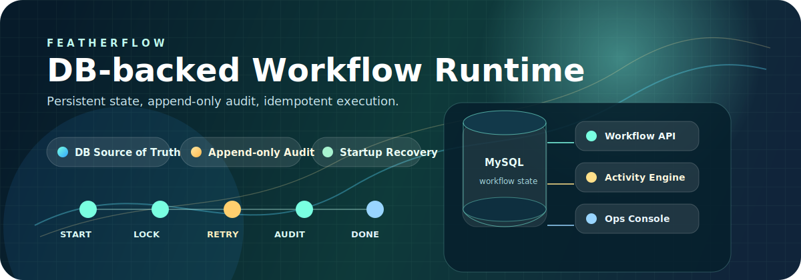
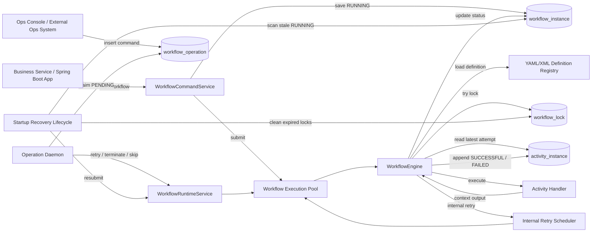
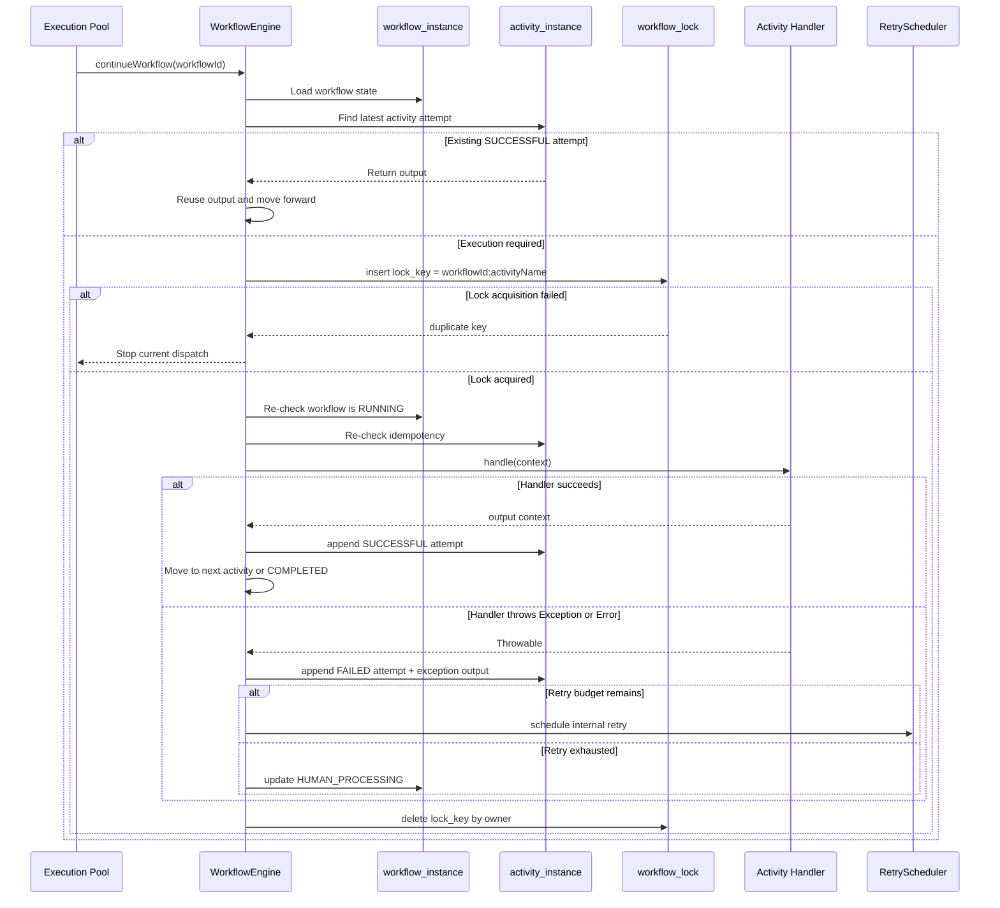

# FeatherFlow

[中文 README](./README.md)

<p align="center">
  
</p>

FeatherFlow is a lightweight Java workflow engine for Spring Boot services. It is not an in-memory-only flow library. It uses the database as the source of truth, uses `input/output` snapshots as workflow context, and uses append-only activity records as the audit model.

It is designed for order fulfillment, resource publishing, asynchronous orchestration, manual intervention, failure retry, operational recovery, and similar business workflows.

Primary goals:

- Make every workflow and every activity traceable, recoverable, and auditable.
- Provide a second-party package that business services can adopt quickly.
- Reduce split-brain risk in multi-node deployments through DB locks, idempotency, and operation claiming.
- Provide clear data contracts for operations consoles and external operational systems.

## Core Capabilities

| Capability | Description |
| --- | --- |
| Persistent runtime state | `workflow_instance`, `activity_instance`, and `workflow_operation` record workflow state, activity attempts, and external commands. |
| Workflow definitions | Supports YAML/XML, single-workflow files, multi-workflow files, mixed loading, and startup-time workflow name uniqueness checks. |
| Context propagation | The workflow `input` is the initial context. A successful activity `output` becomes the next context. A failed retry uses the last failed activity `input`. |
| Append-only activity history | Every completed activity attempt inserts one success or failure row. Failure and retry counts are derived from history. |
| DB distributed lock | Before executing an activity, the engine locks by `workflow_id + activity_name` to avoid concurrent execution of the same step. |
| Idempotent progress | If an activity is already `SUCCESSFUL`, the engine reuses its output and does not run the business handler again. |
| Automatic retry | Failed activities are retried according to retry interval and max retry count. Exhausted retries move the workflow to `HUMAN_PROCESSING`. |
| Manual operations | Supports retry, terminate, and skip latest activity. External systems submit commands through `workflow_operation`. |
| Startup recovery | After Spring startup, stale `RUNNING` workflows are scanned and resubmitted during a bounded 10-minute recovery window. |
| Full-chain logs | workflowId, bizId, bizKey, and node information flow through the logging context, including logs written inside activity handlers. |
| Ops console | A lightweight console shows workflow lists, details, activity timelines, compressed execution paths, and operation history. |

## Documentation Guide

| Goal | Start Here |
| --- | --- |
| Integrate the engine into a business service | Read "Quick Start" and "Spring Boot Configuration". |
| Understand the runtime model | Read "Architecture Overview" and "Activity Execution Sequence", then "Runtime Semantics". |
| Diagnose failures and retries | Read "Activity execution model", "Automatic and manual retry", and "Logging and Observability". |
| Review distributed deployment behavior | Read "Distributed Safety" and "Startup Recovery for Stale RUNNING Workflows". |
| Operate workflows from the console | Read "Ops Console" here, then [`featherflow-ops-console/README.md`](./featherflow-ops-console/README.md) for deployment and page details. |

## Architecture Overview

FeatherFlow follows a simple runtime model: business code starts workflows, framework-owned workers advance them, the database remains the source of truth, and operational commands are claimed asynchronously. Workflow context flows only through `input/output` snapshots. Activity history is append-only, which keeps audit, recovery, and operations queries straightforward.



## Activity Execution Sequence



## Modules

| Module | Responsibility |
| --- | --- |
| `featherflow-core` | Core model, definition parsing, execution engine, retry scheduling, DB locking, repositories, state machines, and runtime services. |
| `featherflow-spring-boot-starter` | Spring Boot auto-configuration, properties, definition loading, execution pools, daemon lifecycle, and startup recovery lifecycle. |
| `featherflow-spring-boot-demo` | Runnable demo for handlers, YAML definitions, REST calls, and local H2 execution. |
| `featherflow-integration-tests` | End-to-end tests for DB locks, idempotency, concurrent retry, and startup recovery. |
| `featherflow-ops-console` | Spring Boot + Thymeleaf + HTMX console that connects directly to the workflow database. |

## Maven Dependency

```xml
<dependency>
    <groupId>com.ywz.workflow</groupId>
    <artifactId>featherflow-spring-boot-starter</artifactId>
    <version>0.0.3-SNAPSHOT</version>
</dependency>
```

Business services should normally depend on the starter. It auto-configures the engine, repositories, DB lock service, execution pools, operation daemon, and startup recovery lifecycle.

## Quick Start

### 1. Define a workflow

`src/main/resources/workflows/order-workflow.yml`

```yaml
workflow:
  name: sampleOrderWorkflow
  activities:
    - name: createOrder
      handler: createOrderHandler
      desc: Create order
      retryInterval: PT5S
      maxRetryTimes: 2
    - name: notifyCustomer
      handler: notifyCustomerHandler
      desc: Notify customer
      retryInterval: PT10S
      maxRetryTimes: 1
```

### 2. Implement an activity handler

```java
@Component("createOrderHandler")
public class CreateOrderHandler implements WorkflowActivityHandler {

    private static final Logger log = LoggerFactory.getLogger(CreateOrderHandler.class);

    @Override
    public Map<String, Object> handle(Map<String, Object> context) {
        log.info("Create order activity started");
        context.put("orderCreated", true);
        return context;
    }
}
```

The handler receives the current workflow context. Its return value is serialized into the current activity `output` and becomes the input context of the next activity.

### 3. Start a workflow

```java
WorkflowInstance workflow = workflowCommandService.startWorkflow(
    "sampleOrderWorkflow",
    "biz-order-10001",
    "order-10001",
    "{\"orderId\":\"order-10001\",\"amount\":100}"
);
```

Parameter semantics:

| Parameter | Description |
| --- | --- |
| `definitionName` | Workflow definition name, matching `workflow.name` in YAML/XML. |
| `bizId` | Business tracking token for this workflow run. Defaults to workflowId if omitted. |
| `bizKey` | Business object operated by the workflow, such as order ID, resource ID, or worker name. Optional and not unique. |
| `input` | Initial workflow context, typically a JSON string. |

Backward-compatible API:

```java
startWorkflow(String definitionName, String bizId, String input)
```

## Spring Boot Configuration

```yaml
featherflow:
  enabled: true
  definition-locations:
    - classpath:/workflows/*.yml
    - classpath:/workflows/*.yaml
    - classpath:/workflows/*.xml

  core-pool-size: 4
  max-pool-size: 8
  queue-capacity: 200

  auto-start-daemon: true
  poll-interval-millis: 1000

  auto-recover-running-workflows: true
  running-workflow-recovery-delay-millis: 30000
  running-workflow-recovery-interval-millis: 30000
  running-workflow-recovery-window-millis: 600000
  running-workflow-recovery-stale-millis: 300000
  running-workflow-recovery-batch-size: 100

  persistence-write-retry-max-attempts: 4
  persistence-write-retry-initial-delay-millis: 100
  persistence-write-retry-max-delay-millis: 1000

  instance-id: 10.9.8.7:workflow-engine-a
```

Key properties:

| Property | Default | Description |
| --- | --- | --- |
| `definition-locations` | `classpath:/workflows/*.yml`, etc. | Workflow definition locations. Multiple paths and wildcards are supported. |
| `auto-start-daemon` | `true` | Starts the daemon that consumes externally written `workflow_operation` commands. |
| `auto-recover-running-workflows` | `true` | Enables startup recovery for stale `RUNNING` workflows. |
| `running-workflow-recovery-window-millis` | `600000` | Scans for up to 10 minutes after startup, then stops the recovery scheduler. |
| `running-workflow-recovery-stale-millis` | `300000` | A `RUNNING` workflow is recoverable only after 5 minutes without modification. |
| `running-workflow-recovery-batch-size` | `100` | Maximum workflows resubmitted in one scan. |
| `persistence-write-retry-*` | See YAML | Bounded retry and exponential backoff for framework-owned critical persistence writes. |
| `instance-id` | Generated | Node identity. A readable value such as `IP:service-name` is recommended. |

## Workflow Definition

### Multi-workflow YAML

```yaml
workflows:
  - name: orderWorkflow
    activities:
      - name: createOrder
        handler: createOrderHandler
        desc: Create order
        retryInterval: PT5S
        maxRetryTimes: 2
      - name: notifyCustomer
        handler: notifyCustomerHandler
        desc: Notify customer
        retryInterval: PT10S
        maxRetryTimes: 1

  - name: fastTrackWorkflow
    activities:
      - name: createOrder
        handler: createOrderHandler
        desc: Fast-track order creation
        retryInterval: PT1S
        maxRetryTimes: 0
```

### XML definition

```xml
<workflows>
  <workflow name="orderWorkflow">
    <activity
        name="createOrder"
        handler="createOrderHandler"
        desc="Create order"
        retryInterval="PT5S"
        maxRetryTimes="2"/>
    <activity
        name="notifyCustomer"
        handler="notifyCustomerHandler"
        retryInterval="PT10S"
        maxRetryTimes="1">
      <desc>Notify customer</desc>
    </activity>
  </workflow>
</workflows>
```

Notes:

- `name` is the unique workflow definition identifier. Duplicate names fail fast at startup.
- `activity.name` participates in idempotency checks and lock key construction. Keep it stable after release.
- `handler` maps to a Spring bean name.
- `desc` is used by ops views and supports both XML attributes and child nodes.
- `retryInterval` uses Java `Duration` syntax, such as `PT5S` or `PT1M`.
- `maxRetryTimes` is the number of automatic retries after failure. Manual retry does not clear failure history.

## Runtime Semantics

### State machines

| Object | States |
| --- | --- |
| workflow | `RUNNING`, `HUMAN_PROCESSING`, `TERMINATED`, `COMPLETED` |
| activity | `SUCCESSFUL`, `FAILED` |
| operation | `PENDING`, `PROCESSING`, `SUCCESSFUL`, `FAILED` |

### Activity execution model

```text
Read latest workflow state
  -> verify workflow is RUNNING
  -> find latest attempt for the activity
  -> if already SUCCESSFUL, reuse output and move forward
  -> acquire DB lock workflow_id + activity_name
  -> re-check idempotency and workflow state
  -> run business handler
  -> on success, insert SUCCESSFUL activity_instance with output
  -> on failure, insert FAILED activity_instance with exception output
  -> decide retry, human processing, or next activity
```

Key semantics:

- Activity rows are inserted only after one execution attempt finishes.
- Both successful and failed attempts are persisted.
- Failure output contains exception type, message, and stack trace summary.
- Retrying a failed activity uses the previous failed attempt `input`.
- The next activity after a successful step uses the previous successful `output`.
- If a workflow is terminated, the engine stops before starting the next activity.

### Automatic and manual retry

Automatic retry is internal and does not write `workflow_operation`.

Manual retry requires the workflow to be `TERMINATED` or `HUMAN_PROCESSING`:

- If the latest activity is `FAILED`, retry uses that failed attempt `input`.
- If the latest activity is `SUCCESSFUL`, retry continues from that successful attempt `output`.
- Failure history is not reset. Retry budget is still derived from persisted failed attempts.

### Skip latest activity

Skip does not require the caller to pass an activityId. It always targets the latest activity:

- The workflow must be `TERMINATED`.
- The engine appends a new `SUCCESSFUL` attempt for the latest activity.
- The skip marker and skip input are written into `output`.
- Retry then lets the engine continue from the next step.

## Data Model

Reference SQL:

- `featherflow-core/src/main/resources/db/featherflow-mysql.sql`
- `featherflow-core/src/main/resources/db/featherflow-h2.sql`

Core tables:

| Table | Description |
| --- | --- |
| `workflow_instance` | Workflow runtime instance: workflowId, bizId, bizKey, workflowName, startNode, input, status. |
| `activity_instance` | Append-only activity attempt history: input, output, status, executedNode. |
| `workflow_operation` | External operational command table for start, retry, terminate, and skip. |
| `workflow_lock` | DB distributed lock table used to prevent concurrent activity execution. |

Important fields:

| Field | Description |
| --- | --- |
| `workflow_id` | Workflow instance ID. Full UUID by default. |
| `biz_id` | Business tracking token for one workflow run. |
| `biz_key` | Business object key for operations searches, such as order ID, resource ID, or worker name. |
| `workflow_name` | Workflow definition name. |
| `start_node` | Node that started the workflow. |
| `executed_node` | Node that executed an activity attempt. |
| `input` / `output` | Workflow and activity context snapshots. |

## Distributed Safety

FeatherFlow intentionally avoids introducing an external coordinator. The database is the lightweight coordination point.

### Activity DB lock

Before running a handler, the engine acquires:

```text
lock_key = workflow_id + ":" + activity_name
owner = instance_id + ":" + thread_id
```

If multiple nodes retry or recover the same workflow concurrently, only the node that obtains the lock enters the handler. Other nodes stop the current dispatch.

### Idempotency

Before and after lock acquisition, the engine checks whether `workflow_id + activity_name` already has a `SUCCESSFUL` attempt:

- If yes, it reuses the output.
- If no, it runs the handler.

This prevents duplicate activity records caused by duplicate dispatch, manual retry races, or startup recovery races.

### Boundary

DB locks and framework idempotency prevent concurrent duplicate execution at the framework layer. They cannot prove whether an external side effect succeeded if the process dies after the side effect but before `activity_instance` is written. Critical handlers should still use business idempotency keys, such as `workflowId + activityName + attempt` or a business-unique order number.

## Startup Recovery for Stale RUNNING Workflows

When a service or Pod restarts, in-memory workflow threads disappear. Some database rows may remain `RUNNING`. The starter uses Spring `SmartLifecycle` for bounded recovery:

```text
Spring context is ready
  -> WorkflowRecoveryLifecycle.start()
  -> wait 30 seconds
  -> scan every 30 seconds for up to 10 minutes
  -> find RUNNING workflows not modified for 5 minutes
  -> resubmit them into the local execution pool
  -> DB lock and idempotency decide whether activity actually runs
```

Recovery properties:

- No new table.
- No heartbeat.
- No lease protocol.
- Before each startup recovery scan, locks whose `workflow_lock.gmt_modified` is older than the stale threshold are cleaned. The default threshold is 5 minutes.
- It does not directly mutate workflow status.
- Multiple nodes may scan concurrently; DB locks and idempotency absorb duplicates.
- A failed scan is caught and logged; later scans continue within the startup window.
- The scheduler stops automatically after the startup window to avoid permanent background load.

Recovery logs include:

- scheduler startup configuration
- each scan's `modifiedBefore`, `staleTimeoutMillis`, and `batchSize`
- number of expired workflow locks cleaned before each startup recovery scan
- each recovered workflow's `workflowId`, `bizId`, `bizKey`, `workflowName`, `startNode`, and `gmtModified`
- submission failures
- startup window expiration and scheduler stop events

## Logging and Observability

The engine opens `WorkflowLogContext` at key runtime points and writes workflow metadata into MDC. Logs written inside activity handlers with ordinary SLF4J loggers inherit the same workflow context.

Recommended log pattern fields:

```text
%X{workflowId} %X{bizId} %X{bizKey}
```

Observable fields:

| Field | Purpose |
| --- | --- |
| `workflowId` | Locate one exact workflow instance. |
| `bizId` | Correlate the business request, user action, or upstream trace. |
| `bizKey` | Search by business object, such as order ID, resource ID, or worker name. |
| `workflowName` | Identify the workflow definition type. |
| `startNode` / `executedNode` | Locate where the workflow started and where each activity ran. |

## Ops Console

`featherflow-ops-console` is a lightweight, non-SPA operations console that connects directly to the workflow database.

Run:

```bash
mvn -q -pl featherflow-ops-console -am spring-boot:run
```

Open:

```text
http://localhost:8080/workflows
```

With a context path:

```text
http://localhost:8080/featherflow/workflows
```

Pages:

| Page | Description |
| --- | --- |
| `/workflows` | Paginated workflow list with filters for workflowId, bizId, bizKey, status, workflowName, and time ranges. |
| `/workflows/{workflowId}` | Workflow detail page with base info, input, activity timeline, compressed execution path, and available operations. |
| `/operations` | Operation history for externally submitted commands. |
| `/health` | Health check endpoint. |

Operations:

- `terminate`: terminates unfinished workflows such as `RUNNING` or `HUMAN_PROCESSING`.
- `retry`: retries `TERMINATED` or `HUMAN_PROCESSING` workflows.
- `skip`: skips the latest activity only when the workflow is `TERMINATED`, then continues execution.

Console operations write `workflow_operation` rows. Business nodes claim operations and delegate to the local runtime service.

## Workflow Query Views

FeatherFlow exposes two activity views:

| View | Description |
| --- | --- |
| Full timeline | Returns every activity attempt, including repeated failures and eventual success. Best for audit and incident review. |
| Compressed execution path | Groups by `workflow_id + activity_name`, returns only the latest result and includes `totalAttempts`, `failedTimes`, `retryTimes`, and `successfulTimes`. Best for operational overview. |

It can also query workflow definition steps by `workflowName`, returning `sequence`, `activityName`, `desc`, `handler`, `retryInterval`, and `maxRetryTimes`.

## Demo

The demo module includes several runnable workflows. Definitions live in `featherflow-spring-boot-demo/src/main/resources/workflows/demo-order-workflow.yml`.

| workflowName | Scenario | What To Observe |
| --- | --- | --- |
| `demoSuccessWorkflow` | Normal successful flow | Two successful activities and final workflow status `COMPLETED`. |
| `demoRetryThenSuccessWorkflow` | First notification attempt fails, automatic retry succeeds | The same activity has one `FAILED` attempt followed by one `SUCCESSFUL` attempt. |
| `demoHumanProcessingWorkflow` | Retry budget is exhausted | The workflow moves to `HUMAN_PROCESSING` and exposes failure output for operations. |
| `demoTerminateSkipWorkflow` | Fail, terminate, then skip the latest activity | Skip appends a successful attempt and continues to the next step. |
| `demoAsyncJobWorkflow` | Split a long task into "submit async job" and "poll result" | The handler avoids long blocking and uses retry to represent "not ready yet". |

Run:

```bash
mvn -q -pl featherflow-spring-boot-demo -am spring-boot:run
```

List runnable scenarios:

```bash
curl http://localhost:8080/demo/workflows/scenarios
```

The endpoint returns each demo `workflowName`, sample `bizId`, sample `bizKey`, expected final state, and suggested operations. Operators can discover runnable samples without reading source code.

Start the success sample:

```bash
curl -X POST http://localhost:8080/demo/workflows/start \
  -H 'Content-Type: application/json' \
  -d '{"workflowName":"demoSuccessWorkflow","bizId":"demo-biz-001","bizKey":"order-001","amount":100,"customerName":"Alice"}'
```

Start the automatic retry sample:

```bash
curl -X POST http://localhost:8080/demo/workflows/start \
  -H 'Content-Type: application/json' \
  -d '{"workflowName":"demoRetryThenSuccessWorkflow","bizId":"demo-biz-retry","bizKey":"order-retry-001","amount":100,"customerName":"Retry Alice"}'
```

Start the human-processing sample:

```bash
curl -X POST http://localhost:8080/demo/workflows/start \
  -H 'Content-Type: application/json' \
  -d '{"workflowName":"demoHumanProcessingWorkflow","bizId":"demo-biz-human","bizKey":"order-human-001","amount":100,"customerName":"Human Alice"}'
```

Start the terminate-and-skip sample:

```bash
curl -X POST http://localhost:8080/demo/workflows/start \
  -H 'Content-Type: application/json' \
  -d '{"workflowName":"demoTerminateSkipWorkflow","bizId":"demo-biz-skip","bizKey":"order-skip-001","amount":100,"customerName":"Skip Alice"}'
```

Start the async-job sample:

```bash
curl -X POST http://localhost:8080/demo/workflows/start \
  -H 'Content-Type: application/json' \
  -d '{"workflowName":"demoAsyncJobWorkflow","bizId":"demo-biz-async","bizKey":"order-async-001","amount":100,"customerName":"Async Alice"}'
```

Query:

```bash
curl http://localhost:8080/demo/workflows/{workflowId}
```

Terminate, retry, and skip:

```bash
curl -X POST http://localhost:8080/demo/workflows/{workflowId}/terminate
curl -X POST http://localhost:8080/demo/workflows/{workflowId}/retry
curl -X POST http://localhost:8080/demo/workflows/{workflowId}/skip
```

Recommended sequence for `demoTerminateSkipWorkflow`: start the workflow, wait until it reaches `HUMAN_PROCESSING`, call `terminate`, then call `skip`. The current `skip` operation resubmits the workflow automatically and continues with the next activity.

Recommended local smoke test:

1. Call `/demo/workflows/scenarios` and choose a scenario.
2. Start it with `/demo/workflows/start` and keep the returned `workflowId`.
3. Query `/demo/workflows/{workflowId}` and verify `bizId`, `bizKey`, `workflowName`, and the latest activity.
4. For `demoRetryThenSuccessWorkflow` or `demoAsyncJobWorkflow`, wait at least one second and observe the failed attempt followed by successful retry.
5. For `demoTerminateSkipWorkflow`, wait for `HUMAN_PROCESSING`, call `terminate`, then call `skip`, and verify the appended skip record plus final `COMPLETED` status.

## Test Coverage

Current tests cover:

- YAML/XML parsing for single and multiple workflow definitions.
- Duplicate workflow name startup failure.
- Activity `desc` parsing.
- start, retry, terminate, and skip semantics.
- Activity failure, automatic retry, and manual retry.
- Append-only activity history and failure counting.
- DB distributed lock behavior under concurrent dispatch.
- Idempotent reuse of successful activity output.
- Two-node concurrent retry and startup recovery split-brain prevention.
- Expired workflow lock cleanup before startup recovery without lock stealing during normal activity execution.
- Spring Boot starter auto-configuration.
- SmartLifecycle startup recovery window, exception handling, and recovery logs.
- Ops Console pages, queries, pagination, JSON display, and health check.

Run:

```bash
mvn test
```

## Release

Deploy the starter and required upstream modules:

```bash
mvn clean deploy -pl featherflow-spring-boot-starter -am -Dmaven.test.skip=true
```

Build Ops Console:

```bash
mvn clean package -pl featherflow-ops-console -am -Dmaven.test.skip=true
```

## Best Practices

- Keep activity names stable after release because they participate in idempotency and lock keys.
- Use business idempotency for critical external side effects such as payment, publishing, and resource deletion.
- Use `bizId` for one workflow trace and `bizKey` for business-object searches. Do not mix their meanings.
- Use ordinary SLF4J logs inside handlers; the framework injects workflow MDC into the execution thread.
- Keep handlers short, retryable, and idempotent. Prefer second-level execution and avoid long synchronous waits while holding an activity lock.
- Split long flows into clear activities and provide `desc` for each step.
- Do not write automatic retries into `workflow_operation`; that table is for external operational commands.
- Configure `instance-id` explicitly in production to identify start and execution nodes.
- Startup recovery cleans locks older than the stale threshold and resubmits stale `RUNNING` workflows. Treat it as lightweight failover, not as an exactly-once transaction protocol.
- If a step is naturally long-running, split it into activities such as "submit async job" and "poll job result" instead of blocking one handler for a long time.

## Design Boundaries

FeatherFlow intentionally remains lightweight. It does not introduce a central scheduler, distributed transaction coordinator, or external state-machine service.

The design prioritizes:

- persistent workflow state
- auditable execution history
- retry and manual intervention
- non-concurrent activity execution under multi-node dispatch
- automatic recovery for stale `RUNNING` workflows after Pod restarts

It does not by itself solve exactly-once external side effects. Business handlers must still provide idempotency for critical external operations.
