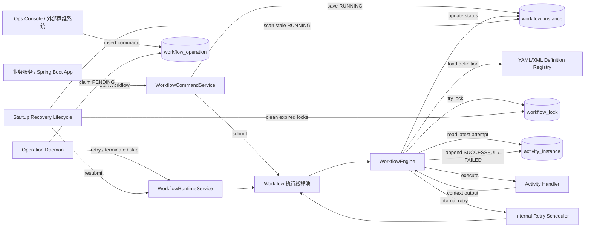
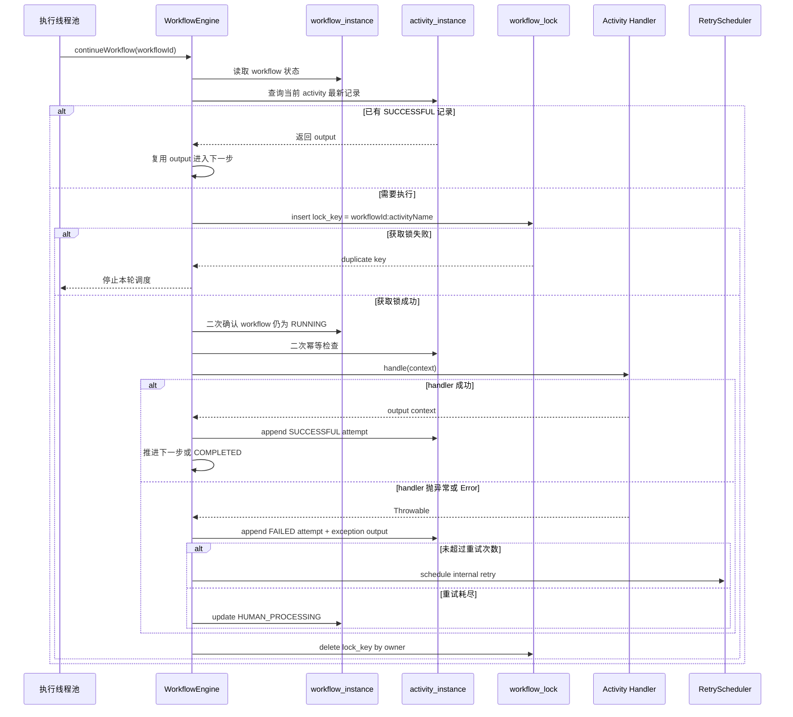

# FeatherFlow

[English README](./README.en.md)

<p align="center">
  
</p>

FeatherFlow 是一个面向 Java / Spring Boot 服务的轻量级工作流引擎。它不是一个只存在于内存里的流程编排工具，而是一个以数据库为事实源、以 `input/output` 为上下文载体、以 append-only activity 记录为审计模型的可运维工作流框架。

它适合处理订单履约、资源发布、异步编排、人工介入、失败重试、运维补偿等业务流程，核心目标是：

- 让每一次 workflow 和每一步 activity 都可追踪、可恢复、可审计。
- 让业务系统通过二方包快速接入，不引入复杂外部中间件。
- 在多机部署下通过 DB 锁、幂等和状态认领降低脑裂风险。
- 给运维控制台和外部运维系统提供清晰的数据模型和操作入口。

## 核心能力

| 能力 | 说明 |
| --- | --- |
| 持久化运行态 | `workflow_instance`、`activity_instance`、`workflow_operation` 记录 workflow、activity 和外部运维命令。 |
| 编排定义 | 支持 YAML/XML，支持单文件多 workflow、多文件混合加载，workflow name 启动时唯一校验。 |
| 上下文流转 | workflow 的 `input` 是初始上下文；activity 成功后 `output` 成为后续上下文；失败重试使用上一条失败 activity 的 `input`。 |
| append-only activity | 每次 activity 执行结束后插入一条成功或失败记录，不覆盖历史，失败次数和重试次数由历史记录计算。 |
| DB 分布式锁 | activity 执行前使用 `workflow_id + activity_name` 获取 DB 锁，避免同一步骤并发执行。 |
| 幂等推进 | 如果某个 activity 已经 `SUCCESSFUL`，后续调度会复用该 output，不重复执行业务逻辑。 |
| 自动重试 | activity 失败后按定义的 retry interval 和 max retry times 延迟重试，重试耗尽进入 `HUMAN_PROCESSING`。 |
| 人工运维 | 支持 retry、terminate、skip latest activity；外部系统可通过 `workflow_operation` 下发命令。 |
| 启动恢复 | Spring 容器启动后 10 分钟内低频扫描 stale `RUNNING` workflow，自动重新投递，防止 Pod 重启导致流程悬挂。 |
| 全链路日志 | workflowId、bizId、bizKey、节点信息进入日志上下文，activity 内业务日志也能串联排查。 |
| 运维控制台 | 内置轻量级 Ops Console，直连数据库展示列表、详情、activity 时间线、压缩执行链路和操作历史。 |

## 文档导航

| 阅读目标 | 建议入口 |
| --- | --- |
| 快速接入业务系统 | 先看“快速开始”和“Spring Boot 配置”。 |
| 理解框架基本原理 | 先看“架构总览”和“Activity 执行时序”，再看“运行时语义”。 |
| 排查失败和重试问题 | 重点看“Activity 执行模型”、“自动重试和人工 retry”、“日志与可观测性”。 |
| 评估分布式部署风险 | 重点看“分布式安全设计”和“启动恢复 stale RUNNING workflow”。 |
| 使用运维控制台 | 先看本 README 的“Ops Console”，详细部署和页面说明见 [`featherflow-ops-console/README.md`](./featherflow-ops-console/README.md)。 |

## 架构总览

FeatherFlow 的核心设计是“业务线程触发、框架线程推进、数据库保存事实、运维命令异步认领”。workflow 的运行上下文只通过 `input/output` 快照流转，activity 历史采用 append-only 模型，方便审计、恢复和运维排查。



## Activity 执行时序



## 模块

| 模块 | 作用 |
| --- | --- |
| `featherflow-core` | 核心模型、定义解析、执行引擎、重试调度、DB 锁、Repository、状态机、运行时服务。 |
| `featherflow-spring-boot-starter` | Spring Boot 自动装配、配置属性、workflow 定义加载、线程池、daemon 和启动恢复生命周期。 |
| `featherflow-spring-boot-demo` | 可运行 demo，展示 Handler 编写、YAML 定义、REST 调用和 H2 本地运行。 |
| `featherflow-integration-tests` | 端到端集成测试，覆盖 DB 锁、幂等、并发 retry、启动恢复等关键语义。 |
| `featherflow-ops-console` | 运维控制台，使用 Spring Boot + Thymeleaf + HTMX 直连数据库展示和操作 workflow。 |

## Maven 接入

```xml
<dependency>
    <groupId>com.ywz.workflow</groupId>
    <artifactId>featherflow-spring-boot-starter</artifactId>
    <version>0.0.3-SNAPSHOT</version>
</dependency>
```

推荐业务系统直接引入 starter。starter 会自动装配执行引擎、Repository、DB 锁、线程池、operation daemon 和启动恢复 lifecycle。

## 快速开始

### 1. 定义 workflow

`src/main/resources/workflows/order-workflow.yml`

```yaml
workflow:
  name: sampleOrderWorkflow
  activities:
    - name: createOrder
      handler: createOrderHandler
      desc: 创建订单 / Create order
      retryInterval: PT5S
      maxRetryTimes: 2
    - name: notifyCustomer
      handler: notifyCustomerHandler
      desc: 通知客户 / Notify customer
      retryInterval: PT10S
      maxRetryTimes: 1
```

### 2. 实现 activity handler

```java
@Component("createOrderHandler")
public class CreateOrderHandler implements WorkflowActivityHandler {

    private static final Logger log = LoggerFactory.getLogger(CreateOrderHandler.class);

    @Override
    public Map<String, Object> handle(Map<String, Object> context) {
        log.info("Create order activity started");
        context.put("orderCreated", true);
        return context;
    }
}
```

handler 的入参是当前 workflow context。返回值会序列化后写入本次 activity 的 `output`，并作为下一步 activity 的输入上下文。

### 3. 启动 workflow

```java
WorkflowInstance workflow = workflowCommandService.startWorkflow(
    "sampleOrderWorkflow",
    "biz-order-10001",
    "order-10001",
    "{\"orderId\":\"order-10001\",\"amount\":100}"
);
```

参数语义：

| 参数 | 说明 |
| --- | --- |
| `definitionName` | workflow 定义名称，对应 YAML/XML 里的 `workflow.name`。 |
| `bizId` | 本次 workflow 的业务追踪 token；不传时默认使用 workflowId。 |
| `bizKey` | 被 workflow 操作的业务对象标识，例如订单号、资源 ID、workerName；可为空，不做唯一约束。 |
| `input` | workflow 初始上下文，建议使用 JSON 字符串。 |

兼容旧接口：

```java
startWorkflow(String definitionName, String bizId, String input)
```

## Spring Boot 配置

```yaml
featherflow:
  enabled: true
  definition-locations:
    - classpath:/workflows/*.yml
    - classpath:/workflows/*.yaml
    - classpath:/workflows/*.xml

  core-pool-size: 4
  max-pool-size: 8
  queue-capacity: 200

  auto-start-daemon: true
  poll-interval-millis: 1000

  auto-recover-running-workflows: true
  running-workflow-recovery-delay-millis: 30000
  running-workflow-recovery-interval-millis: 30000
  running-workflow-recovery-window-millis: 600000
  running-workflow-recovery-stale-millis: 300000
  running-workflow-recovery-batch-size: 100

  persistence-write-retry-max-attempts: 4
  persistence-write-retry-initial-delay-millis: 100
  persistence-write-retry-max-delay-millis: 1000

  instance-id: 10.9.8.7:workflow-engine-a
```

关键配置说明：

| 配置 | 默认值 | 说明 |
| --- | --- | --- |
| `definition-locations` | `classpath:/workflows/*.yml` 等 | workflow 定义文件位置，支持多个路径和通配符。 |
| `auto-start-daemon` | `true` | 是否启动 `workflow_operation` 扫描 daemon，用于消费外部运维命令。 |
| `auto-recover-running-workflows` | `true` | 是否启用启动恢复 stale `RUNNING` workflow。 |
| `running-workflow-recovery-window-millis` | `600000` | 应用启动后最多扫描 10 分钟，窗口结束后恢复扫描器自动停止。 |
| `running-workflow-recovery-stale-millis` | `300000` | `RUNNING` workflow 5 分钟未更新才视为 stale。 |
| `running-workflow-recovery-batch-size` | `100` | 单轮最多重新投递的 workflow 数量。 |
| `persistence-write-retry-*` | 见配置 | 框架关键写库的有限重试和指数退避配置。 |
| `instance-id` | 自动生成 | 节点标识，建议显式配置为 `IP:服务名` 或 `IP:节点名`。 |

## Workflow 定义格式

### YAML 单文件多 workflow

```yaml
workflows:
  - name: orderWorkflow
    activities:
      - name: createOrder
        handler: createOrderHandler
        desc: 创建订单 / Create order
        retryInterval: PT5S
        maxRetryTimes: 2
      - name: notifyCustomer
        handler: notifyCustomerHandler
        desc: 通知客户 / Notify customer
        retryInterval: PT10S
        maxRetryTimes: 1

  - name: fastTrackWorkflow
    activities:
      - name: createOrder
        handler: createOrderHandler
        desc: 快速创建订单 / Fast-track order creation
        retryInterval: PT1S
        maxRetryTimes: 0
```

### XML 定义

```xml
<workflows>
  <workflow name="orderWorkflow">
    <activity
        name="createOrder"
        handler="createOrderHandler"
        desc="创建订单 / Create order"
        retryInterval="PT5S"
        maxRetryTimes="2"/>
    <activity
        name="notifyCustomer"
        handler="notifyCustomerHandler"
        retryInterval="PT10S"
        maxRetryTimes="1">
      <desc>通知客户 / Notify customer</desc>
    </activity>
  </workflow>
</workflows>
```

说明：

- `name` 是 workflow 定义唯一标识，所有加载文件内不能重复。
- `activity.name` 用于幂等判断和锁 key 生成，建议在一个 workflow 内保持稳定。
- `handler` 对应 Spring Bean 名称。
- `desc` 可用于运维台展示步骤含义，支持 XML 属性和 XML 子节点。
- `retryInterval` 使用 Java `Duration` 格式，例如 `PT5S`、`PT1M`。
- `maxRetryTimes` 是失败后的自动重试次数；失败历史不会被手工 retry 重置。

## 运行时语义

### 状态机

| 对象 | 状态 |
| --- | --- |
| workflow | `RUNNING`、`HUMAN_PROCESSING`、`TERMINATED`、`COMPLETED` |
| activity | `SUCCESSFUL`、`FAILED` |
| operation | `PENDING`、`PROCESSING`、`SUCCESSFUL`、`FAILED` |

### Activity 执行模型

一次 activity 调度会经历以下步骤：

```text
读取 workflow 当前状态
  -> 检查 workflow 是否仍为 RUNNING
  -> 查找当前 activity 最新执行记录
  -> 如果已 SUCCESSFUL，复用 output 并进入下一步
  -> 获取 DB 分布式锁 workflow_id + activity_name
  -> 再次检查幂等和 workflow 状态
  -> 执行业务 handler
  -> 成功写入 activity_instance SUCCESSFUL + output
  -> 失败写入 activity_instance FAILED + 异常 output
  -> 根据失败次数判断自动重试、人工处理或继续下一步
```

关键语义：

- activity 记录只在一次执行结束后插入；成功和失败都会落库。
- activity 失败时，异常类型、异常消息和堆栈摘要会写入 `output`。
- 如果当前 activity 重试，输入来自上一条失败 activity 的 `input`。
- 如果上一个 activity 成功，下一个 activity 的输入来自上一个成功 activity 的 `output`。
- 如果 workflow 被 terminate，执行线程会在进入下一步前检查状态并停止推进。

### 自动重试和人工 retry

自动重试不写 `workflow_operation`，由框架内部 retry scheduler 延迟投递。

手工 retry 要求 workflow 处于 `TERMINATED` 或 `HUMAN_PROCESSING`。retry 不需要调用方传 activity 参数：

- 最新 activity 是 `FAILED` 时，使用该失败记录的 `input` 重新执行当前步骤。
- 最新 activity 是 `SUCCESSFUL` 时，使用该成功记录的 `output` 继续执行下一步骤。
- 历史失败次数不清零，重试预算仍通过 DB 中失败记录统计。

### Skip 最新 activity

skip 不要求调用方指定 activityId。当前设计固定跳过最新 activity：

- workflow 必须是 `TERMINATED`。
- 框架会把最新 activity 订正为一条新的 `SUCCESSFUL` 尝试记录。
- `output` 中会写入 skip 标记和 skip 输入。
- 然后通过 retry 让引擎从下一步继续判断。

## 数据模型

参考 SQL：

- `featherflow-core/src/main/resources/db/featherflow-mysql.sql`
- `featherflow-core/src/main/resources/db/featherflow-h2.sql`

核心表：

| 表 | 说明 |
| --- | --- |
| `workflow_instance` | workflow 运行实例，保存 workflowId、bizId、bizKey、workflowName、startNode、input、status。 |
| `activity_instance` | activity 执行历史，append-only 保存每次尝试的 input、output、status、executedNode。 |
| `workflow_operation` | 外部运维命令表，用于跨系统发起 start、retry、terminate、skip。 |
| `workflow_lock` | DB 分布式锁表，用于防止同一 activity 并发执行。 |

关键字段：

| 字段 | 说明 |
| --- | --- |
| `workflow_id` | workflow 实例 ID，默认使用完整 UUID。 |
| `biz_id` | 一次 workflow 的业务追踪 token，适合串联请求链路。 |
| `biz_key` | 被 workflow 操作的业务对象 ID，适合运维检索和业务对象视角排查。 |
| `workflow_name` | workflow 定义名称。 |
| `start_node` | workflow 启动节点。 |
| `executed_node` | activity 实际执行节点。 |
| `input` / `output` | workflow 和 activity 的上下文快照。 |

## 分布式安全设计

FeatherFlow 当前不引入额外协调服务，使用数据库作为轻量级协调点。

### Activity DB 锁

activity 执行前会尝试获取 DB 锁：

```text
lock_key = workflow_id + ":" + activity_name
owner = instance_id + ":" + thread_id
```

如果多个节点同时 retry 或启动恢复同一个 workflow，只有拿到锁的节点会进入 handler。未拿到锁的节点会停止本轮推进，避免同一步骤并发执行。

### 幂等检查

锁前和锁后都会检查 `workflow_id + activity_name` 是否已有 `SUCCESSFUL` 记录：

- 如果存在，直接复用 output。
- 如果不存在，才执行 handler。

这可以防止重复调度、重复 retry、启动恢复扫描并发带来的重复 activity 记录。

### 边界说明

DB 锁和框架幂等能保证同一 activity 在框架层不会被并发重复执行。但如果业务 handler 的外部副作用已经成功，而框架在写入 `activity_instance` 前宕机，框架无法自动判断外部系统是否已经完成。因此强烈建议业务侧对关键外部调用使用业务幂等键，例如 `workflowId + activityName + attempt` 或业务唯一单号。

## 启动恢复 stale RUNNING workflow

服务重启或 Pod 重建时，内存中的 workflow 执行线程会消失，数据库里可能残留 `RUNNING` 状态。FeatherFlow 通过 starter 中的 `SmartLifecycle` 实现轻量恢复：

```text
Spring 容器启动完成
  -> WorkflowRecoveryLifecycle.start()
  -> 延迟 30 秒开始扫描
  -> 启动后 10 分钟内每 30 秒扫描一次
  -> 找到 gmt_modified 超过 5 分钟未更新的 RUNNING workflow
  -> 重新投递到本机 workflow 执行线程池
  -> activity DB 锁和幂等决定是否真正执行
```

恢复策略特点：

- 不新增表，不引入 lease，不引入心跳。
- 每轮启动恢复扫描前，会先清理 `workflow_lock.gmt_modified` 早于 stale 阈值的残留锁，默认清理 5 分钟前的锁。
- 不直接修改 workflow 状态，只重新调度。
- 多节点同时扫描也允许，DB 锁和幂等会挡住重复执行。
- 单轮扫描异常会被 catch 并记录 error，后续扫描继续进行。
- 启动窗口到期后 recovery scheduler 自动停止，避免长期后台扫描带来额外负载。

恢复相关日志会打印：

- recovery scheduler 启动配置。
- 每轮扫描的 `modifiedBefore`、`staleTimeoutMillis`、`batchSize`。
- 每轮启动恢复前清理过期 workflow lock 的数量。
- 每个被恢复 workflow 的 `workflowId`、`bizId`、`bizKey`、`workflowName`、`startNode`、`gmtModified`。
- 提交失败原因。
- 启动窗口结束和 scheduler 停止事件。

## 日志与可观测性

框架会在关键执行点打开 `WorkflowLogContext`，将 workflow 信息写入 MDC。业务 handler 中使用普通 SLF4J logger 打印日志时，也能继承当前执行线程里的 workflow 上下文。

建议业务日志格式包含：

```text
%X{workflowId} %X{bizId} %X{bizKey}
```

可观测字段：

| 字段 | 作用 |
| --- | --- |
| `workflowId` | 精确定位一次 workflow 实例。 |
| `bizId` | 串联业务请求、用户操作或上游 trace。 |
| `bizKey` | 从业务对象视角检索，例如订单号、资源 ID、workerName。 |
| `workflowName` | 区分流程定义类型。 |
| `startNode` / `executedNode` | 定位 workflow 在哪个节点启动、activity 在哪个节点执行。 |

## Ops Console

`featherflow-ops-console` 是一个轻量级运维控制台，不做前后端分离，直接连接 workflow 数据库。

启动：

```bash
mvn -q -pl featherflow-ops-console -am spring-boot:run
```

访问：

```text
http://localhost:8080/workflows
```

如果配置了 context path：

```text
http://localhost:8080/featherflow/workflows
```

核心页面：

| 页面 | 说明 |
| --- | --- |
| `/workflows` | workflow 分页列表，支持 workflowId、bizId、bizKey、status、workflowName、时间范围筛选。 |
| `/workflows/{workflowId}` | workflow 详情，展示基础信息、输入、activity 时间线、压缩执行链路和可用操作。 |
| `/operations` | operation 历史，展示外部运维命令执行结果。 |
| `/health` | 健康检查接口。 |

运维动作：

- `terminate`：允许终止 `RUNNING`、`HUMAN_PROCESSING` 等未完成 workflow。
- `retry`：允许重试 `TERMINATED` 或 `HUMAN_PROCESSING` workflow。
- `skip`：允许在 `TERMINATED` 状态下跳过最新 activity，然后继续推进。

运维台动作会写入 `workflow_operation`，由业务节点上的 daemon 认领并转调本地 runtime service。

## Workflow 查询能力

框架和运维台区分两类 activity 视图：

| 视图 | 说明 |
| --- | --- |
| 完整时间线 | 返回每一次 activity 尝试，包括多次失败和最终成功，适合审计和问题复盘。 |
| 压缩执行链路 | 按 `workflow_id + activity_name` 聚合，只返回每个 activity 最新一次结果，并返回 `totalAttempts`、`failedTimes`、`retryTimes`、`successfulTimes`，适合运维总览。 |

同时支持按 `workflowName` 查询定义内的全部 activity 步骤，返回 `sequence`、`activityName`、`desc`、`handler`、`retryInterval`、`maxRetryTimes`，方便运维台展示标准流程定义。

## Demo

Demo 模块内置了多组可直接运行的样例，定义文件在 `featherflow-spring-boot-demo/src/main/resources/workflows/demo-order-workflow.yml`。

| workflowName | 场景 | 观察重点 |
| --- | --- | --- |
| `demoSuccessWorkflow` | 正常成功流程 | 两个 activity 成功，workflow 最终 `COMPLETED`。 |
| `demoRetryThenSuccessWorkflow` | 第一次通知失败，自动重试后成功 | `activity_instance` 中同一 activity 先 `FAILED` 后 `SUCCESSFUL`。 |
| `demoHumanProcessingWorkflow` | 重试次数耗尽进入人工处理 | workflow 进入 `HUMAN_PROCESSING`，方便在运维台观察失败输出。 |
| `demoTerminateSkipWorkflow` | 先失败进入人工处理，再 terminate + skip 最新 activity | skip 会插入一条成功记录并继续推进到下一步。 |
| `demoAsyncJobWorkflow` | 长任务拆成“提交异步任务”和“轮询结果” | handler 不长时间阻塞，通过重试表达异步任务未完成。 |

启动 demo：

```bash
mvn -q -pl featherflow-spring-boot-demo -am spring-boot:run
```

查看可运行场景目录：

```bash
curl http://localhost:8080/demo/workflows/scenarios
```

这个接口会返回每个 demo 的 `workflowName`、样例 `bizId`、样例 `bizKey`、预期终态和建议操作。运维同学不需要翻源码，也能直接知道哪些场景可以启动。

启动正常成功样例：

```bash
curl -X POST http://localhost:8080/demo/workflows/start \
  -H 'Content-Type: application/json' \
  -d '{"workflowName":"demoSuccessWorkflow","bizId":"demo-biz-001","bizKey":"order-001","amount":100,"customerName":"Alice"}'
```

启动自动重试样例：

```bash
curl -X POST http://localhost:8080/demo/workflows/start \
  -H 'Content-Type: application/json' \
  -d '{"workflowName":"demoRetryThenSuccessWorkflow","bizId":"demo-biz-retry","bizKey":"order-retry-001","amount":100,"customerName":"Retry Alice"}'
```

启动人工处理样例：

```bash
curl -X POST http://localhost:8080/demo/workflows/start \
  -H 'Content-Type: application/json' \
  -d '{"workflowName":"demoHumanProcessingWorkflow","bizId":"demo-biz-human","bizKey":"order-human-001","amount":100,"customerName":"Human Alice"}'
```

启动 terminate + skip 样例：

```bash
curl -X POST http://localhost:8080/demo/workflows/start \
  -H 'Content-Type: application/json' \
  -d '{"workflowName":"demoTerminateSkipWorkflow","bizId":"demo-biz-skip","bizKey":"order-skip-001","amount":100,"customerName":"Skip Alice"}'
```

启动异步任务样例：

```bash
curl -X POST http://localhost:8080/demo/workflows/start \
  -H 'Content-Type: application/json' \
  -d '{"workflowName":"demoAsyncJobWorkflow","bizId":"demo-biz-async","bizKey":"order-async-001","amount":100,"customerName":"Async Alice"}'
```

查询：

```bash
curl http://localhost:8080/demo/workflows/{workflowId}
```

终止、重试、跳过最新 activity：

```bash
curl -X POST http://localhost:8080/demo/workflows/{workflowId}/terminate
curl -X POST http://localhost:8080/demo/workflows/{workflowId}/retry
curl -X POST http://localhost:8080/demo/workflows/{workflowId}/skip
```

`demoTerminateSkipWorkflow` 推荐操作顺序是：启动 workflow，等待进入 `HUMAN_PROCESSING`，调用 `terminate`，再调用 `skip`。当前 `skip` 会自动重新投递 workflow 并继续执行后续 activity。

推荐的本地 smoke test 路径：

1. 调用 `/demo/workflows/scenarios` 选择一个场景。
2. 使用 `/demo/workflows/start` 启动，并记录返回的 `workflowId`。
3. 使用 `/demo/workflows/{workflowId}` 查询状态，确认 `bizId`、`bizKey`、`workflowName` 和最新 activity。
4. 对 `demoRetryThenSuccessWorkflow` 或 `demoAsyncJobWorkflow` 等待 1 秒以上，观察失败记录后自动重试成功。
5. 对 `demoTerminateSkipWorkflow` 等待 `HUMAN_PROCESSING` 后依次调用 `terminate`、`skip`，观察跳过记录和最终 `COMPLETED`。

## 测试覆盖

当前测试覆盖重点：

- YAML/XML 单 workflow 和多 workflow 解析。
- duplicate workflow name 启动失败。
- activity desc 解析。
- start、retry、terminate、skip 运行语义。
- activity 失败、自动重试、人工 retry。
- append-only activity 记录和失败次数统计。
- DB 分布式锁防并发执行。
- 幂等复用成功 activity output。
- 双节点并发 retry 和启动恢复防脑裂。
- 启动恢复前清理过期 workflow lock，但 activity 正常执行路径不抢占锁。
- Spring Boot starter 自动装配。
- SmartLifecycle 启动恢复窗口、异常兜底和日志输出。
- Ops Console 页面、查询、分页、JSON 展示和健康检查。

运行测试：

```bash
mvn test
```

## 发布

发布 starter 及其依赖模块：

```bash
mvn clean deploy -pl featherflow-spring-boot-starter -am -Dmaven.test.skip=true
```

构建 Ops Console：

```bash
mvn clean package -pl featherflow-ops-console -am -Dmaven.test.skip=true
```

## 最佳实践

- activity name 一旦上线尽量不要随意修改，因为它参与幂等判断和锁 key。
- 关键外部副作用必须有业务幂等，例如支付、发布、删除资源。
- `bizId` 用于一次 workflow 链路追踪，`bizKey` 用于业务对象维度检索，两者不要混用。
- handler 内日志使用 SLF4J 即可，框架会在线程上下文中注入 workflow MDC。
- handler 应保持短执行、可重试、可幂等；建议秒级完成，避免在 activity 锁内做长时间同步等待。
- 对长流程建议拆分 activity，让每一步都有清晰 `desc`，便于运维台展示。
- 不要把自动重试写入 `workflow_operation`；operation 表只作为外部运维命令入口。
- 生产环境建议显式配置 `instance-id`，方便定位启动节点和执行节点。
- 启动恢复会清理超过 stale 阈值的残留锁并重新投递 `RUNNING` workflow；这是轻量 failover，不是严格 exactly-once 事务协议。
- 如果某个步骤天然耗时很长，建议拆成“提交异步任务”和“查询任务结果”两个或多个 activity，不要让单个 handler 长时间阻塞。

## 设计边界

FeatherFlow 刻意保持轻量，不引入复杂调度中心、分布式事务协调器或外部状态机服务。当前设计优先保证：

- 流程状态可持久化。
- 执行历史可审计。
- 失败可重试和人工介入。
- 多节点调度下 activity 不并发重复执行。
- Pod 重启后 stale `RUNNING` workflow 能自动恢复。

它不试图单独解决外部系统副作用的 exactly-once 问题。对于支付、资源创建、发布上线等关键动作，业务 handler 必须配合业务幂等设计。
